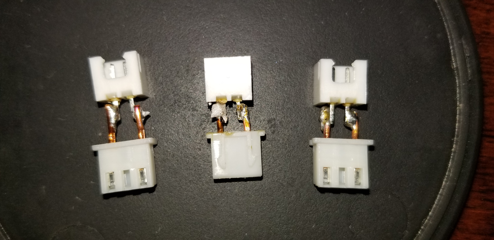
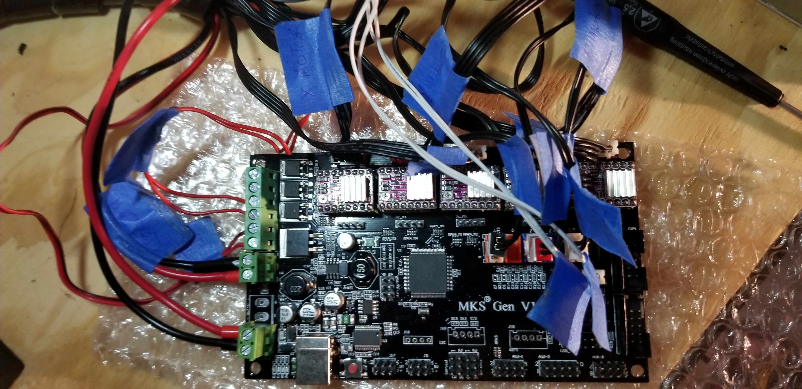
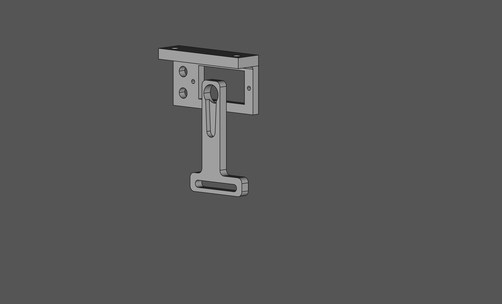

TLDR; A "How To" on upgrading a Duplicator i3 with modern 3D printer parts, firmware, and creativity. This post is still progress.

The Duplicator i3 is a common 3D printer that many now consider out dated. Instead of throwing it away and buying a new one, I took the challenge of upgrading and/or replacing parts to modernize it. There is also a lot of resources and parts still available.

## The "To-Do" List

- Glass bed
- 1/16 to 1/32 steps for steppers. This provides cleaner and smoother prints.
- Replace existing Melzi board with a [MKS Gen 1.4 board](https://amzn.to/2yT1NlY). This could have been the standard RepRap Arudino Mega 2560 board as well.

  - JST 2 pin to 3 pin adapters for end stop connectors.
  - Add JST connector for extruder stepper
  - Marlin Firmware changes

    - Invert End stops
      ```cpp
      #define X_MIN_ENDSTOP_INVERTING true // Set to true to invert the logic of the endstop.
      #define Y_MIN_ENDSTOP_INVERTING true // Set to true to invert the logic of the endstop.
      #define Z_MIN_ENDSTOP_INVERTING true // Set to true to invert the logic of the endstop.
      ```
    - DRV8825 Driver Types uncomment these and replace with `DRV8825`

      ```cpp
        #define X_DRIVER_TYPE  DRV8825
        #define Y_DRIVER_TYPE  DRV8825
        #define Z_DRIVER_TYPE  DRV8825
        #define Z2_DRIVER_TYPE DRV8825
        #define E0_DRIVER_TYPE A4988
        #define E1_DRIVER_TYPE DRV8825
      ```

    - Double step count `DRV8825` from 1/16 to 1/32 steps. This comes from the previous Marlin configuration which was `#define DEFAULT_AXIS_STEPS_PER_UNIT { 80, 80, 400, 100 }`. I've kept the extruder on a `A4988` chip as the heat was building on too much on it. Calibrate to `0.84` volts.

      ```cpp
        #define DEFAULT_AXIS_STEPS_PER_UNIT   { 160, 160, 800, 100 }
      ```

    - Invert X and Y directions. Invert extruder direction.

      ```cpp
        #define INVERT_X_DIR true
        #define INVERT_Y_DIR true
        #define INVERT_E0_DIR true
      ```

    - Set Z travel limit. `#define Z_MAX_POS 180`
    - SD Card Support `#define SDSUPPORT`.
    - LCD Support for [RepRap Discount Full Smart Controller](https://amzn.to/2JygbSy) `#define REPRAP_DISCOUNT_FULL_GRAPHIC_SMART_CONTROLLER`

- `DRV8825` calibration. The formula is VREF = Rated motor current / 2 . So a standard NEMA 17 motor is rated at 1.68 amps. Divided by 2 it's .84 volts. I burned out an extruder stepper following this. I dropped it to .6 volts. The steppers were less hot and no performance difference. Checkout
- Replace display. The connectors are backwards for the standard RepRap Discount Full Smart Controller. Some Amazon reviews pointed this out.
- Replace power supply. [Found a 30A on Amazon for \$20](https://amzn.to/2XP8wpz). The current 20A power supply is under powered. It's a known issue with these printers.
- Replace Y bracket.
<!-- - OctoPrint works but there is a bug where you need to set the serial speed to `Auto` otherwise it fails to connect. -->
- Easy access case for MKS Gen board
- Filament sensor
- Cover and mount for power supply
- (Tested this but ended up reverting it) Manual LCD Bed leveling with `#define MESH_BED_LEVELING`, `#define PROBE_MANUALLY` and `#define LCD_BED_LEVELING`. uncommented [LCD assisted bed leveling](https://marlinfw.org/docs/configuration/probes.html)
- Auto Bed Leveling using Z Probe Servo

  - Wiring
  - Marlin Configuration https://www.youtube.com/watch?v=6msLOR_EfKc and https://marlinfw.org/docs/configuration/probes.html. Uncomment the following lines.

    ```cpp
      #define AUTO_BED_LEVELING_LINEAR
      #define NUM_SERVOS 3
      #define Z_PROBE_SERVO_NR 0
      #define Z_SERVO_ANGLES { 80, 0 } // This one is important on the servo arm deploy and retraction
      #define USE_ZMAX_PLUG  // I have an extra z max to use so this is used for the switch on the servo arm
      #define Z_CLEARANCE_BETWEEN_PROBES  10 // Z Clearance between probe points
      #define Z_CLEARANCE_MULTI_PROBE     10 // Z Clearance between multiple probes
      #define Z_PROBE_LOW_POINT          -10 // Farthest distance below the trigger-point to go before stopping
      #define Z_MIN_PROBE_USES_Z_MIN_ENDSTOP_PIN
      #define Z_MIN_PROBE_PIN 19 // Pin 32 is the RAMPS default but we are using a MKS Gen 1.4 Board
    ```

    - `M280` important! This controls the servo. Use this for testing: https://marlinfw.org/docs/gcode/M280.html . Use the values gathered here to set `Z_SERVO_ANGLES` property.
      - Get servo 0 angle: `M280 P0`
      - Move servo 0 to a 90 degree angle: `M280 P0 S90`
      - Move servo 0 to a 0 degree angle: `M280 P0 S0`
    - Set marlin config of zprobe offset `#define NOZZLE_TO_PROBE_OFFSET { -1, -40, -7.7 }`
    - `M420` get/set bed level state https://marlinfw.org/docs/gcode/M420.html
    - `M119` Endstop states
    - `G29` start the auto bed leveling routine.

[Click here for the full Marlin config difference](/marlinConfigDiff.html).





## Lessons Learned

- Learned how to configure and almost build a 3d printer using an existing one.
- Spent way more time than expected.

## Resources

- <https://marlinfw.org/>
- <https://3dprinterwiki.info/wanhao/wanhao-duplicator-i3/>
- <https://gist.github.com/jdembowski/f3d2f9da41519aa73ecc591353e09bd5>
- <http://www.ti.com/lit/ds/symlink/drv8825.pdf>
