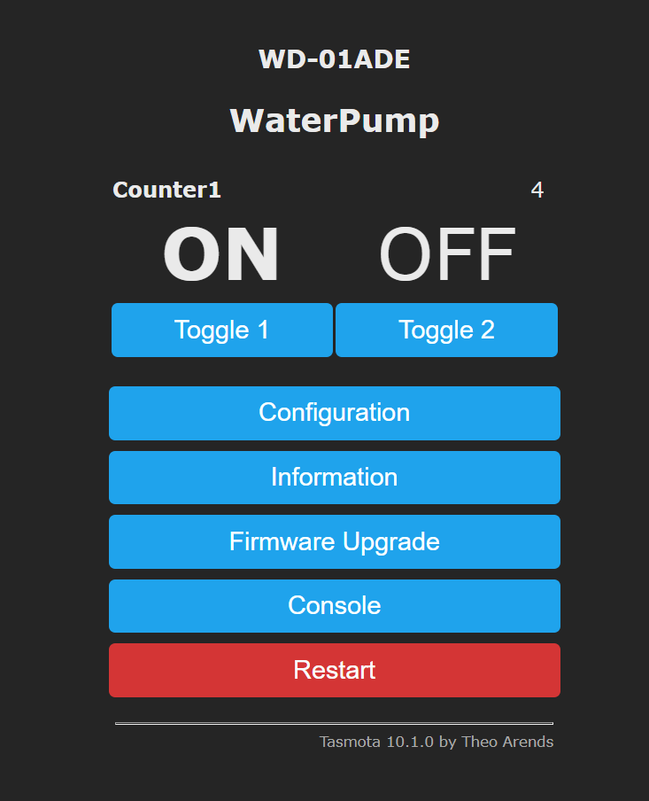

Ever have your central AC unit turn off all of sudden?  If your a home owner, this is a common source of annoyance. It's the most common reason why service is called for.  **The air conditioner condensate drain line is blocked.** The solution is to clean the AC condensate drain line every month with a 1/4 cup of vinegar then flush with water once a month.  You have to remember to do this tho and it's easily forgotten. Should be done more frequently to prevent any mold or bacteria build up. This post is a how-to-guide to configure an off-the-shelf smart wifi dual water pump to flush out this line on a regular basis.

## Plan

- Flash the device with Tasmota firmware
- Set up a water reservoir
- Route water line to the AC condensate drain line opening.  Usually near the start of the heating/fan unit.
- Add rules to manage water pump timing and notifications.
  
## Water Pump Preparation

I ordered this [wifi dual water pump](https://www.amazon.com/dp/B08T9KLDHD?&linkCode=ll1&tag=dctm-20&linkId=da5e68dd8503f9f127b2e0c5222d3424&language=en_US&ref_=as_li_ss_tl) from Amazon then flashed it following [this guide](https://templates.blakadder.com/WD-01ADE.html)d.  The only tricky part here was the soldering wires to those connections shown in the image in the guide. I followed the traces and solder unto those instead.  It gave a bit more room to work with.  Then flash with [Tasmotizer](https://github.com/tasmota/tasmotizer/releases),

The other change that was to count the amount of times the pump was trigger adding a Tasmota counter.  This needs to be done after the template was set by going to:

`Configuration > Configure Template > GPIO16 to Counter` with counter drop down selected as `1`. The value is stored even after a reboot is done!

## Set up a Water Reservoir

Take an old vinegar plastic bottle and a poked a hole in it.  After that, hot glue in one of the fittings the came from the water pump supplies.  Be sure to poke a hole in the top so air can enter the bottle.

## Tasmota Rules

 Add this rule when the pump1 has started. It will schedule to turn off in 30 seconds which should disperse abount 1 cup of vinegar/water mixture. Adds one to to Counter 1.

    Rule1 on power1#state=1 do backlog RuleTimer2 30; counter1 +1 endon on Rules#Timer=2 do power1 off endon
 
    Rule1 on

Turn on pump one every day at 4am within a 15 minute window.

    Timer1 {"Enable":1,"Time":"4:00","Window":15,"Days":"SMTWTFS","Repeat":1,"Output":1,"Action":1}

    Timers on

Now the vinegar/water will fill up with AC condensate line.  My water line is also attached to the water heater excess water line so it will get flushed out usually within a few hours.

Lastly, if the device restarts then ensure water pump relays are off by default. This is now the default with Tasmota firmware.

    PowerOnState 0

All of it together (use as you will):

Final results for the web ui

MQTT Sensor topic

    tele/tasmota_XXXXX/SENSOR = {"Time":"2021-12-31T09:39:59","COUNTER":{"C1":3}}

<!-- ## Future Improvements

Based on the counter, send an alert to refill the reservoir tank. -->

### Resources

- https://templates.blakadder.com/WD-01ADE.html
- https://blairsair.com/unclog-ac-condensate-line
- https://github.com/tasmota/tasmotizer/releases
- [Tasmota Device Manager](https://tasmota.github.io/docs/Tasmota-Device-Manager/)
- https://tasmota.github.io/docs/PowerOnState/