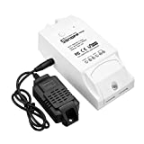
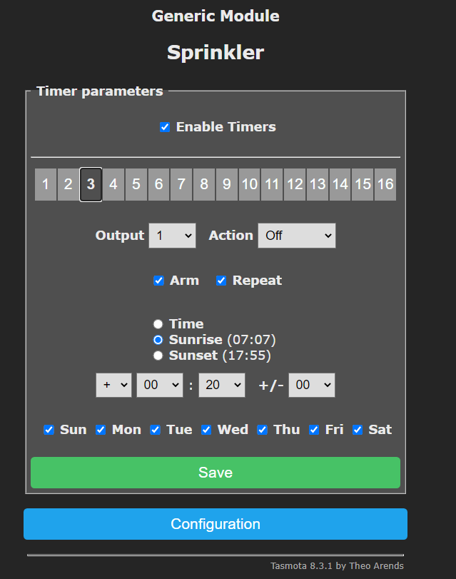
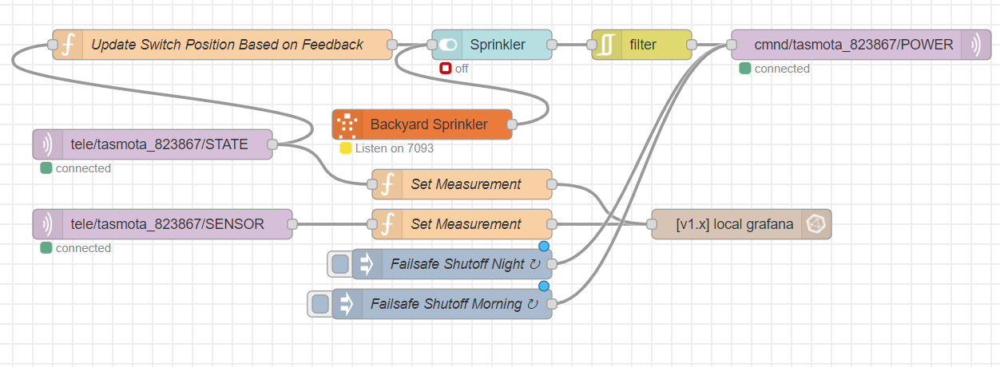
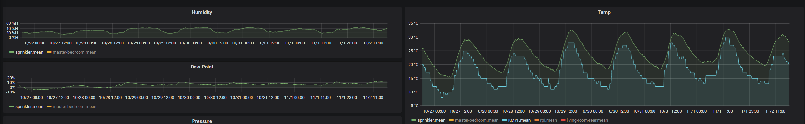

I'm frustrated on over-the-shelf sprinkler systems for home owners. They are complicated to use, outdated, and can't customize at a good price.  The concept of "set it and forget" is not efficient for water or power.

## UPDATE 11/01/2020

I took on the challenge of creating PCB with a [Esp8266 microcontroller](https://amzn.to/3oWMCNZ), [oled screen](https://amzn.to/3oTJUZj), [solid state relay](https://amzn.to/2TNYaoe) and a [BME280 (temperature, humidity, and pressure)](https://amzn.to/365HD4Z). I've been running this setup for 6 months with no problems.  See below for more details!


## Project Research

How to do this for less, better, and low effort? A possible solution is a mix of inexpensive hardware and customized open source software with ability to extend it. The primary objective is to trigger a water sprinkler solenoid to toggle based on special conditions like time (including sunrise/sunset), humidity, and perhaps temperature. So let's make it!

<small>(there is affiliate links on this page for hardware used in this project)</small>

### Must Haves

* ✅ IoT device runs when the internet is down (or network is down).
* ✅ Timer based watering (support for sunrise/sunset as well)
* ✅ Manual toggling watering state
* ✅ Backup / Restore settings
* 🚧 If sunrise/sunset with a temperature restriction then start watering. To prevent freezing of plant roots.

### Wants

* ✅ Measure water time, humidity, and temperature (All off-the-shelf sprinklers do this with various features)
* ✅ Local network control with no data submitted to third party
* ✅ graphing and ability to analyze the data
* 🚧 Watering runaway protection
* ⏳ If humidity is at percentage then skip watering today (Most over-the-shelf sprinklers do this)
* ⏳ If weather forecast is rainy then skip watering. Notify me when this occurs. (Most off-the-shelf sprinklers can do this sort of)
* ⏳ Send to notification to any platform I want (AWS, Gmail, IFTTT, Alexa, etc... )
* ⏳ Moisture sensor

### Hardware

At the lowest level, the IoT hardware should be the following:

* Toggle power on/off
* Report power state, humidity, and temperature
* Not require an internet connection.
* Customize power toggling based on special conditions. 

\$20 USD over-the-shelf Sonoff hardware that does those 3 out of 4 easily. The 4th point needs to have special programming.  There are multiple options out there but this fulfills the need of an "over-the-shelf" device that can be used with open source software.

[](https://amzn.to/3jKFeT8) 

The easiest way to wire this up is using an existing extension cord, cut into it, then follow the directions of wiring Sonoff guide.  Plug one into the power supply of an existing water sprinkler adapter.

<a href="https://www.amazon.com/Reliapro-ADU240100D5531-Adapter-Transformer-Straight/dp/B00B8866E2/ref=as_li_ss_il?crid=1ZIS37DPUSEP9&dchild=1&keywords=sprinkler+transformer+24v&qid=1604364226&sprefix=sprinkler+tran,aps,294&sr=8-4&linkCode=li2&tag=dctm-20&linkId=c84c864b9723984df298c2d892724ab9&language=en_US" target="_blank"></a>

### Software

 The device can be flashed with open source software [Tasmota](https://tasmota.github.io/docs/).  I prototyped with the Arduino IDE for awhile but Tasmota seems safer with features needed. So I won't go into too much detail but Tasmota solves the following problems:

* Local network controlled
* Runs even when the internet is down
* Highly customizable and battle tested for years. 
* Simple programming
* Multiple ways of interacting (command line, MQTT, web UI)

Here is a video on how to flash and setup the device when you get it (this is really common with this device). 

<iframe width="560" height="315" src="https://www.youtube.com/embed/LwZltnda4v8" frameborder="0" allow="accelerometer; autoplay; encrypted-media; gyroscope; picture-in-picture" allowfullscreen></iframe>

### Setup Time

Using the Tasmota Web Console Command line

* Set your time zone using standard GMT offset: `Timezone -8` .
  * This doesn't account for daylight savings time. See docs https://tasmota.github.io/docs/FAQ/
* Test your time with `time` 
* Update your location (use can use https://www.latlong.net/)
    - Run `Latitude 0.0000` for latitude. Replace `0.0000` with proper value.
    - Run `Longitude 0.0000` for longitude. Replace `0.0000` with proper value.
* Run `STATUS 7` to see sunrise / sunset with local time. Ensure it's the actual time.

### Setup Timers

Using the Tasmota Timer Web UI, 4 timers will be created. Two timers for starting/stopping the watering at sunrise. Two timers for same at sunset. 

❓ Why use the Web UI when Tasmota can do this via command line? 

⭐ Makes it easily adjustable in Web UI vs using the Tasmota command line. Set each day to water (daily, every other day, or just particular days of the week).

Setup a sunrise starting timer. Be sure to put check in `Enable Timers`, `Arm`, and `Repeat` . 


Setup the sunset starting timer the same. 

Now to stop the watering. Setup Timer 3 for like this with a 20 minute offset. This allows for 20 minutes of watering. Do the same for Timer 4 for sunset.  Per the Tasmota docs:

> When Mode 1 or Mode 2 is used, Latitude and Longitude become available. In that case the Time value is always used as an offset so make sure to set it to 00:00 if no offset is wanted



Using the Tasmota Web Console Command line, type in the timers to verify:
`Timer1` , `Timer2` , `Timer3` and `Timer4` . 

It should look like this:

``` 
14:35:44 CMD: Timer1
14:35:44 MQT: stat/tasmota_6A24DE/RESULT = {"Timer1":{"Arm":1,"Mode":1,"Time":"00:00","Window":0,"Days":"1111111","Repeat":1,"Output":1,"Action":1}}
14:35:47 CMD: Timer2
14:35:47 MQT: stat/tasmota_6A24DE/RESULT = {"Timer2":{"Arm":1,"Mode":2,"Time":"00:00","Window":0,"Days":"1111111","Repeat":1,"Output":1,"Action":1}}
14:35:50 CMD: Timer3
14:35:50 MQT: stat/tasmota_6A24DE/RESULT = {"Timer3":{"Arm":1,"Mode":1,"Time":"00:20","Window":0,"Days":"1111111","Repeat":1,"Output":1,"Action":0}}
14:35:52 CMD: Timer4
14:35:52 MQT: stat/tasmota_6A24DE/RESULT = {"Timer4":{"Arm":1,"Mode":2,"Time":"00:20","Window":0,"Days":"1111111","Repeat":1,"Output":1,"Action":0}}
```

## Runaway Protection

The first runaway protection is the secondary timers 3 and 4.

A secondary way to add a runaway protection was `pulsetime` with Tasmota commands but their was some certain conditions that would cause it to reset for long running power state (see here: https://github.com/arendst/Tasmota/issues/7810). Not ideal in our case.

The third way is using NodeRed to trigger a power state off if receiving MQTT messages.  This could be adapted to turn off timers when the weather is expected to rain.

Using Graphana, I've prototyped using alerts as well just incase all else fails.

## Extending to other Platforms (Optional)

Using a simple flow in NodeRed, I've added support for a UI and Alexa control with tracking usage via Graphana. Using the MQTT message `tele/tasmota_YOURDEVICE/SENSOR` , the data is formatted and sent to a [local Graphana instance](https://grafana.com/tutorials/install-grafana-on-raspberry-pi/#3) on a Raspberry PI. 




Simple tracking the ON/OFF state of tasmota MQTT messages




### Setup Rules (Optional)

Here are two more timers (or rules) wanted:

* 🚧 before sunrise, check the temperature. if it's too cold, send a MQTT message and disable start timers
* 🚧 before sunrise, check the humidity, if it's raining then disable timer.

## Resources

* https://tasmota.github.io/docs/Commands/
* https://tasmota.github.io/docs/Timers/
