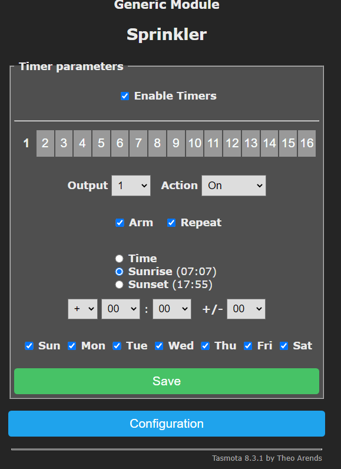

I'm frustrated on over-the-shelf sprinkler systems for a home owners. They are complicated to use, outdated, and can't customize at a good price.  The open source community has solved this!  After testing serveral solutions, this was easiest, reliable and most customizable. So let's make it!

## Build a Watering sprinkler for less, better and for low effort

The primary objective is customizing the watering sprinkler to toggle based on special conditions like time, humditity, and perhaps temperature.  

### Objectivies (and some "want-to-haves")

- If humidity is at percentage then skip watering today (Most over-the-shelf sprinklers do this).
- If weather forecast is rainy then skip watering. Notify me when this occurs. (Most off-the-shelf sprinklers can do this sort of)
- If sunrise/sunset with a temperature restriction then start watering.
- Measure water time, humidity, and temperature (All off-the-shelf sprinklers do this with various features)
- Manual toggling watering state.
- Watering runaway protection.
- IoT device runs when the internet is down (or network is down).
- Backup / Restore settings
- (Optional) Send to notification to any platform I want (AWS, Gmail, IFTTT, Alexa, etc...)
- (Optional) Local network control with no data submitted to third party.
- (Optional) graphing and ability to analyze the data.

## Research

No over-the-shelf sprinkler system for a reasonable price can do ALL of this! How to do this for less, better, and low effort? The best solution is a mixed of inexpensive hardware and customizable open source software. Yes, there is some learning here but it's only the initial effort that can be a hurdle.

### Hardware

At the lowest level, the IoT hardware should run on it's own, inexpensive, and must do the following:

- Toggling power on/off
- Current humidity and temperature
- Customize toggling on/off based on special conditions.

\$20 USD over-the-shelf Sonoff hardware that does those 2 out of 3. There is alternatives but this is a good start. Two options to hook it up to an existing water system, splice into 110 volt power cord or cut a splice into a power extension cord.

.

### Software

The device can be flashed with open source software [Tasmota](https://tasmota.github.io/docs/). I won't go into too much detail but he it solves the following:

- Local network controlled
- Runs even when the internet is down
- Highly customizable and battle tested for years.

Here is a video on how to flash and setup the device when you get it (this is really common with this device).

<iframe width="560" height="315" src="https://www.youtube.com/embed/LwZltnda4v8" frameborder="0" allow="accelerometer; autoplay; encrypted-media; gyroscope; picture-in-picture" allowfullscreen></iframe>

### Setup Time

Using the Tasmota Web Console Command line
- Set your timezone using standard GMT offset: `Timezone -7`.
- Test your time with `time`
- Update your location (use can use https://www.latlong.net/)
    - Run `Latitude 0.00` for latitude
    - Run `Longitude 0.00` for longitude
- Run `STATUS 7` to see sunrise / sunset with local time

### Setup Timers

Using the Tasmota Timer Web UI, 4 timers will be created.  Two timers for starting/stoping the watering at sunrise. Two timers for same at sunset.  

❓ Why use the Web UI when Tasmota can do thisvia command line? 

⭐ Makes it easily adjustable vs use the tasmota command line.

Setup a sunrise starting timer for to run for 15 minutes (within a 5 minute window).  Be sure to put check in `Enable Timers` and `Arm`.  

Setup the sunset starting timer the same.

Now to stop the watering. Setup Timer 3 for like this.  

A offset is used to stop the watering from occuring because it's sunrise/sunset + 15 minutes.  The documentation states the following:
> When Mode 1 or Mode 2 is used, Latitude and Longitude become available. In that case the Time value is always used as an offset so make sure to set it to 00:00 if no offset is wante

Using the Tasmota Web Console Command line to verify:
`Timer1`, `Timer2`, `Timer3` and `Timer4`, 

### Setup Rules (Optional)

Using the Tasmota Web Console Command line

Rule1 if BME280.Humidity is over 80% then disable timer 1 and timer 2
Rule2 if BME280.Humidity is less than 80% then enable timer 1 and timer 2
Rule3 if mqtt msg is true then disable rule1, rule2, and disable timers

## Extending to other Platforms (Optional)

- NodeRed
- AWS IoT
- Alexa

## Conclusion

## Dwonl

### Lessons

## Resources
- https://tasmota.github.io/docs/Commands/
- https://tasmota.github.io/docs/Timers/