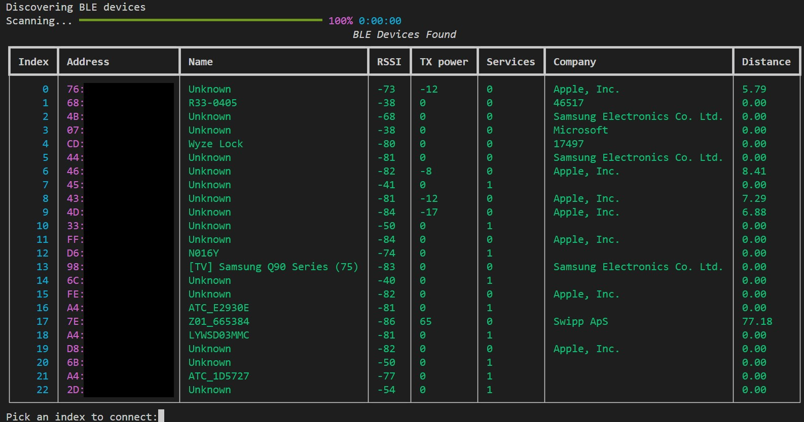
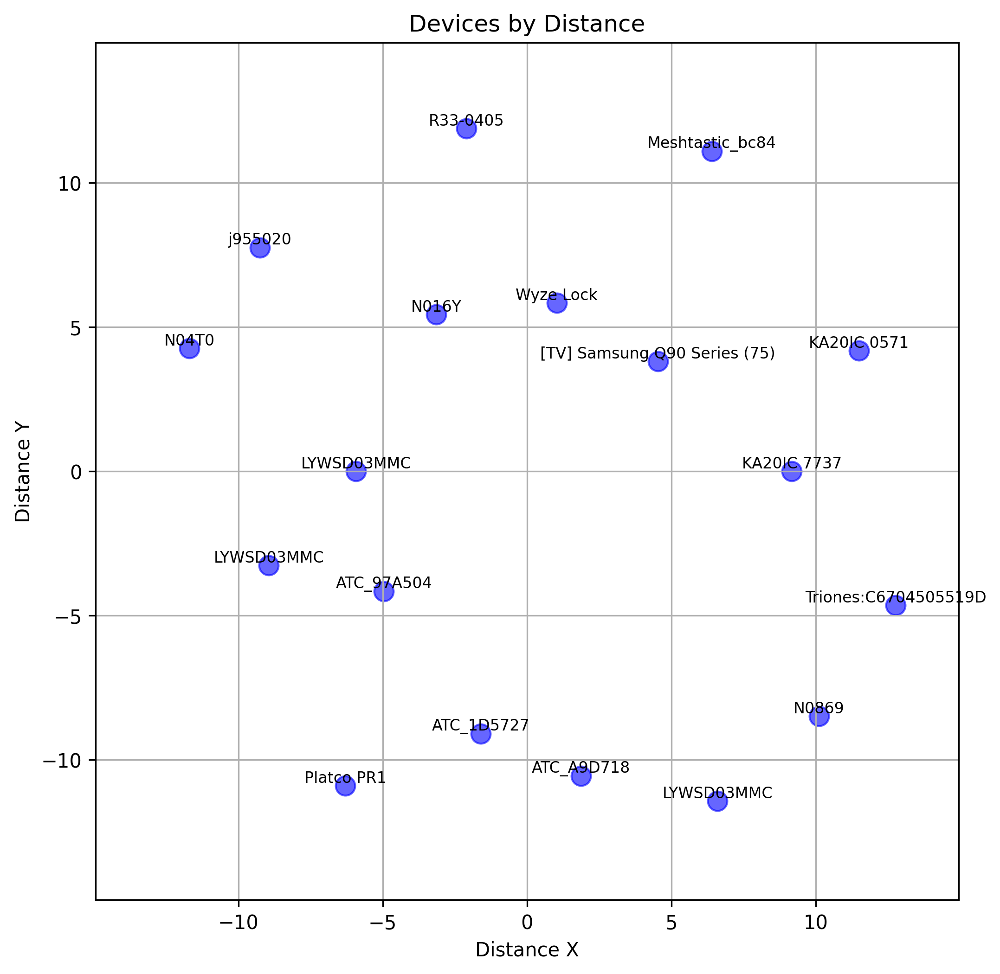

<!-- ---
title: "The Hidden Risks of Bluetooth: What Hackers Already Know"
keywords:
    - bluetooth
    - ble
    - bleak
    - wall of sheep
    - python
date: 2024-09-07
description: An inspired project from DEFCON 2024 of the Wall of Sheep with ble devices
image: images/ble_wall_of_sheep.jpg
alt: A bluetooth device that can be discovered with simple scan.
priority: 0.9
--- -->

<b>TL;DR</b> Bluetooth low energy devices are easy to track. Here's how hackers do it, why random MAC addresses don't fully protect you, and what data you're leaking right now.

--------

Imagine walking through a crowded city, your Bluetooth devices quietly broadcasting signals that can be tracked, analyzed, and even exploited. At DEFCON 2024, I explored the 'Wall of Sheep' - a showcase of unsecured networks and realized how easily Bluetooth devices reveal more than we think. Here's what hackers already know and what you should too.

## Test it yourself

From your phone use [nRF Connect](https://play.google.com/store/apps/details?id=no.nordicsemi.android.nrfconnectdevicemanager&hl=en&gl=US).  Easily scan devices around you.  Allows looking through [service](https://bitbucket.org/bluetooth-SIG/public/raw/025ac280519f8ad3967f79ee45bd921a76003113/assigned_numbers/uuids/service_uuids.yaml) and characteristics data (such as temperature, humidity, battery levels).

[bleak](https://bleak.readthedocs.io/en/latest/installation.html) is a common python library that can be imported in to do a quick basic scan.

```python
from bleak import cli
cli()
```

Output:

```bash
68:00:00:00:00:00: R33-0405
68:00:00:00:00:00: R33-0405
4D:00:00:00:00:00: None
74:00:00:00:00:00: None
74:00:00:00:00:00: None
D6:00:00:00:00:00: N016Y
```

At first glance, this might seem harmless but combined with a persistent scan, tracking becomes scarily effective.

## Detailed Scanning



Here is a [tool on github](https://github.com/skittleson/bluetooth-wos) that device company, services, and distance.  The rest of the post will be gaining insights for data that could be accumulated with long detailed scanning.


### Random MAC addresses don't protect you - here's why hackers don’t care

When a device uses random MAC address rotation to evade tracking, it's true that this makes it challenging to identify the same device over time. However, there are ways to overcome this challenge. For instance, you can analyze the RSSI (Received Signal Strength Indicator) values for each device in your scan results. Since the device is not moving, its RSSI should remain relatively consistent across multiple scans, even if its MAC address changes. By monitoring the RSSI values and correlating them with other data points such as device type or service characteristics, you can improve your chances of accurately tracking devices that use random MAC rotation.

### How can you track distances?



The official way is to use the device transmission power, receiving power, and signal propagation ( this value changes in a line of sight, walls, or heavy interference see [quick reference](https://stackoverflow.com/a/24245724) and [research paper](https://www.semanticscholar.org/paper/Evaluation-of-the-reliability-of-RSSI-for-indoor-Dong-Dargie/9e1bb0d0a75570c54c4c144c8a08e8b54721149a)). 


	distance = 10^((tx_power - rssi) / (10 * signal_propagation_constant))

In the simplest terms, signal propagation constant is a based on the environment i.e walls, interference, metal, and really anything that can stop a signal. The range is usually between 2-10, with 2 being in an open space and 10 with heavy interference.  If you know one of the values then slid the value as a reference point.

How do you do it with a device's RSSI only?  Not nearly as accurate BUT there is an approximation.

	For each device missing TX Power but having RSSI:
    distance(device) = average_distance(devices with same RSSI)

	If no exact RSSI match:
    distance(device) = average_distance(devices with closest RSSI value)

A slightly optimized approach is to use log distance loss model:
	
	RSSI = C - 10n × log₁₀(distance)

⭐ What's more interesting is known device distance that can hint at the other devices distances! For example, if you know you are in a line of sight and one device is telling you 5 meters with and RSSI of 40 likely the other device that has no TX power but RSSI of 40 is also within 5 meters.  This assumes the environment and the TX power of the reference device is similar to the device without TX power information.  With the limiting testing i've done, it seems TX power of most devices are in a common range.


## Static BLE Devices = Surveillance Tools

Static devices that never ever move.  TVs, lights, temps, smart locks, etc.  the interesting thing about these are location indicators and/or human presence indicators.  For example, on all Samsung TVs the BLE doesn't show up until the TV is ON and disappears when OFF.  Which could give insight if someone is watching TV ( or that a TV is on).  Security focused individuals should disable ALL wifi/bluetooth on devices that don't need it!

⭐ Static devices that DO move... like AirTags, Tiles, and BLE tags are REALLY interesting since allows tracking of coming/going.

### Company / Manufacturer of each device

Its mostly open source at a [public source](https://bitbucket.org/bluetooth-SIG/public/raw/025ac280519f8ad3967f79ee45bd921a76003113/assigned_numbers/company_identifiers/company_identifiers.yaml) which can be helpful to identity common devices. Easier to find exploits and/or features. 

### Services

These devices can have well known services / characteristics!  Temperature and humidity is fairly common.  Battery service as well. Auto resolving these can be tricky since most required a device to "notify".

## Insights

- Human presence
	- a TV being ON/OFF is a clear indicator if someone is home... or going to bed
	- AirTag/Tile seen then disappearing then reappearing at certain times of the day (when someone is coming home!)
- The ability to get distances using other devices that transmission power.
- Exposure of semi-sensitive information such as using the device metadata.

### How to protect yourself

While complete protection is impossible, you can reduce your exposure:

- Disable Bluetooth when not in use: The simplest way to avoid tracking.
- Use Airplane Mode in sensitive areas: Prevent devices from broadcasting altogether.
- Block known static BLE devices: Identify and disable BLE on devices like smart TVs.
- [Use Faraday Bags](https://www.amazon.com/Faraday-Protector-Fireproof-Waterproof-Anti-Theft/dp/B0C7FVS19F?crid=1SXC30KG6KNXU&dib=eyJ2IjoiMSJ9.fvv9HNDPK-uUz75Rwiea1Ga50ZS_OE-AtEf2MMtELCEc75aHc2ODm16XPQKWMrhIPJjn_JHA-WvRr_94jhK30IemM9qw7lSbwdQjNaD4a8Ir1Xm8fW-j4QsprxHkbZ4LndUE23m3q_swgJrzJNV-voc23izIRAsoyDD3fSU3MO-gfxxlcHGfjxWz8QxgyrseHjbT2Oe7QsX_Eup4-NJHAoDxcKsGHSsJQuW3b6K8PggWfkVdHA4CHJgy4LKyU5zWXCEtBCgNlFAMQnoWbACIiyrMJ8nzozgUrAAP3Ezvr8Y.zlxdBO02avEGAXQtuLEPzZXgadwtf5O395lsjlPgJMU&dib_tag=se&keywords=faraday+bags&qid=1741332977&sprefix=farada%2Caps%2C157&sr=8-1-spons&sp_csd=d2lkZ2V0TmFtZT1zcF9hdGY&psc=1&linkCode=ll1&tag=dctm-20&linkId=28f21501f6240100bad06108b1e95def&language=en_US&ref_=as_li_ss_tl): For ultra-sensitive environments, these block all radio signals.

### References
 
 - https://www.beaconzone.co.uk/blog/category/rssi/
 - [bleak](https://bleak.readthedocs.io/en/latest/installation.html)
 - https://www.appelsiini.net/2017/trilateration-with-n-points/
