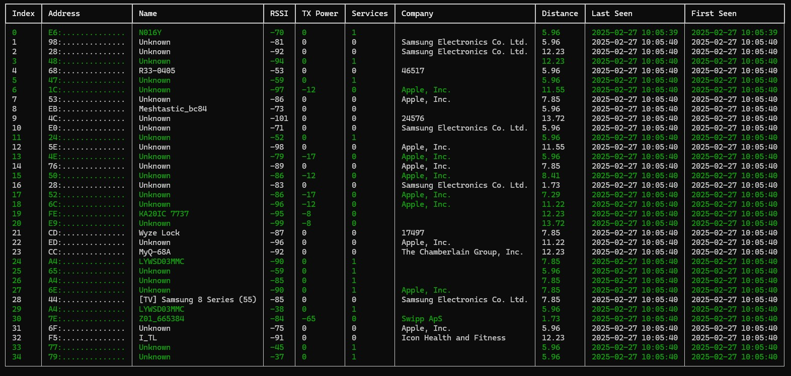

<!-- ---
title: "The Hidden Risks of Bluetooth: What Hackers Already Know"
keywords:
    - bluetooth
    - ble
    - bleak
    - wall of sheep
    - python
date: 2024-09-07
description: An inspired project from DEFCON 2024 of the Wall of Sheep with ble devices
image: images/ble_wall_of_sheep.jpg
alt: A bluetooth device that can be discovered with simple scan.
priority: 0.9
--- -->

Imagine walking through a crowded city, your Bluetooth devices quietly broadcasting signals that can be tracked, analyzed, and even exploited. At DEFCON 2024, I explored the 'Wall of Sheep' - a showcase of unsecured networks and realized how easily Bluetooth devices reveal more than we think. Here's what hackers already know and what you should too.

## Scanning is Straightforward

From your phone use [nRF Connect](https://play.google.com/store/apps/details?id=no.nordicsemi.android.nrfconnectdevicemanager&hl=en&gl=US).  Easily scan devices around you.  Allows looking through [service](https://bitbucket.org/bluetooth-SIG/public/raw/025ac280519f8ad3967f79ee45bd921a76003113/assigned_numbers/uuids/service_uuids.yaml) and characteristics data (such as temperature, humidity, battery levels).

[bleak](https://bleak.readthedocs.io/en/latest/installation.html) is a common python library that can be imported in to do a quick basic scan.

```python
from bleak import cli
cli()
```

Output:

```bash
68:00:00:00:00:00: R33-0405
68:00:00:00:00:00: R33-0405
4D:00:00:00:00:00: None
74:00:00:00:00:00: None
74:00:00:00:00:00: None
D6:00:00:00:00:00: N016Y
3A:00:00:00:00:00: None
29:00:00:00:00:00: None
63:00:00:00:00:00: None
7F:00:00:00:00:00: None
6F:00:00:00:00:00: None
A4:00:00:00:00:00: None
5A:00:00:00:00:00: None
```

## Detailed Scanning



There is useful information here such as device company, services, and distance.

### Random MAC addresses preventable tracking (or do they).

When a device uses random MAC address rotation to evade tracking, it's true that this makes it challenging to identify the same device over time. However, there are ways to overcome this challenge. For instance, you can analyze the RSSI (Received Signal Strength Indicator) values for each device in your scan results. Since the device is not moving, its RSSI should remain relatively consistent across multiple scans, even if its MAC address changes. By monitoring the RSSI values and correlating them with other data points such as device type or service characteristics, you can improve your chances of accurately tracking devices that use random MAC rotation.


### How can you track distances?

The official way is to use the device transmission power,  receiving powers, and signal propagation (in a line of sight, walls, or heavy interference). https://stackoverflow.com/a/24245724

	distance = 10^((tx_power - rssi) / (10 * signal_propagation_constant))


How do you do it with a device's RSSI only?  Not nearly as accurate BUT there is an approximation.

	For each device missing TX Power but having RSSI:
    distance(device) = average_distance(devices with same RSSI)

	If no exact RSSI match:
    distance(device) = average_distance(devices with closest RSSI value)

A slightly better optimized approach is to use log distance loss model,
	
	RSSI = C - 10n × log₁₀(distance)

What's more interesting is device present that can hint at the other devices distance.

For example, if you know you are in a line of sight and one device is telling you 5 meters with and RSSI of 40 likely the other device that has no tx but RSSI of 40 is also within 5 meters.  THIS IS USEFUL!


## Static Addressable BLE Devices

These devices usually have services and characteristics... more on that later.

Static devices that never ever move.  TVs, lights, temps, smart locks, etc.  the interesting thing about these are location indicators or human presence indicators.  For example, on all Samsung TVs the BLE doesn't show up until the TV is ON and disappears when OFF.  Which could give insight if someone is watching TV ( or that a TV is on).  Security focused individuals should disable ALL wifi/bluetooth on devices that don't need it!

Static devices that DO move... like AirTags, Tiles, and BLE tags.  these are REALLY interesting... you can just track when someone is coming/going (as long as they have the tag)

### Services

These devices can have well known services / characteristics !  Temperature and humidity is fairly common.  Battery service as well. There is a really good app to call nr toolbox. Good to discover locally.  Auto resolving these can be tricky since most required a device to be notified.

### Insights

- Human presence.
	- a TV being ON/OFF is a clear indicator if someone is home... or going to bed
	- AirTag/Tile seen then disappearing then reappearing at certain times of the day (when someone is coming home!)
- Resolving distances by using other devices around it that support transmission power.
- Exposure of semi-sensitive information such as device metadata and/or data.


### References
 
 - https://www.beaconzone.co.uk/blog/category/rssi/
 - Bleak