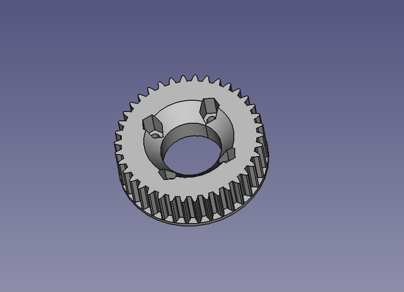

<!--
- Get picture of wizard setup
- Get post picture of skateboard
-->

Electric longboard that can be built at home for fun! The post goes through the adventure of building a safe and inexpensive electric longboard aka esk8.

## The Build

### Deck and Trucks

The deck style will determine the size of the motor, case, and batteries. Passenger weight should also be a factor. I picked a [flexible longboard deck](https://amzn.to/2zezUVCS). It's a bigger deck that provides stability while riding while making it easier to mount components.

Most skateboard truck hangers are not long which limits the selection. Space is needed to mount an electric motor with an attached gear to the wheel. Several Esk8 forums posts pointed to this 10 inch [truck](https://amzn.to/3f2e4DX) that has a square hanger. This solid metal [mounting kit](https://amzn.to/3f3lFlL) is designed to work with this style of truck.

### Electric Speed Controller

Also known as the ESC. The foundation to building an electrical skateboard is the electronic parts, constraints, and physical layout of components. Here is an electrical diagram of the build. [More information here](https://www.electric-skateboard.builders/t/wiki-a-beginner-guide-to-diy-an-esk8/46844).

An electrical speed controller can control the speed of an electric motor using a signal provided by a remote. This signal acts as throttle for the electric motor. First attempt was an inexpensive \$25 120A ESC (electric speed controller) for RC projects.  While it worked the ESC got too hot 🔥🔥🔥.  It wasn't designed for the amount amps pushing through and the motor was over sized.  These RC ESCs have simple configurations.

An open source project, [VESC](https://vesc-project.com/), is a software controlled electronic speed control made for scooters, skateboards, and bikes for a reasonable price!  All the configuration is done through software with a wizard that is easy to follow with great documentation. Before buying any parts, checkout the [VESC calculator](https://vesc-project.com/calculators) to help purchase motors and batteries. You can purchase one from Amazon [here](https://amzn.to/2Yd5Nqd).  I did burn out on of these so be careful.

### Batteries

⚠️ Disclaimer!! Batteries are dangerous!⚠️ Be extra careful on handling and wiring them. There are 2 primary choices for batteries: lithium ion and lithium polymer (lipo). Similar in chemistry but used in different applications. Both can work in this project. In earlier experiments, lipos were used since they are smaller and avaliable. In the 2nd prototype, two 10s2p batteries from hoverboards were used. I wanted a battery management systems aka BMS in to each battery pack with a standard charging mechanisms. The batteries are inexpensive with capacity at 4.4ah. Connecting 2 batteries in parallel increases it to 8.8ah which is near perfect for the VESC to push to the motor. Combing the 2 batteries in parallel made it a 10s4p.

For 3rd prototype, I sourced 18650 batteries from ebay to create two 6s3p batteries with no BMS. Samsung and LG batteries are the safest. Each 6s battery pack can individually be charged on a hobby grade charger. It becomes a 12s3p with 7.5ah.  No BMS this time as a 12s BMS is uncommon. BMSes are great for most projects but it seemed to get in the way of the overall end goal.  The low battery protection is no longer present which is a valid concern that will get resolved in software.

Here are the materials used to create the batteries:

Kapton Tape
<iframe style="width:120px;height:240px;" marginwidth="0" marginheight="0" scrolling="no" frameborder="0" src="//ws-na.amazon-adsystem.com/widgets/q?ServiceVersion=20070822&OneJS=1&Operation=GetAdHtml&MarketPlace=US&source=ss&ref=as_ss_li_til&ad_type=product_link&tracking_id=dctm-20&language=en_US&marketplace=amazon&region=US&placement=B072Z92QZ2&asins=B072Z92QZ2&linkId=b952e68c4a1207be9c0ee9b02a64e918&show_border=true&link_opens_in_new_window=true"></iframe>

Nickel Strips
<iframe style="width:120px;height:240px;" marginwidth="0" marginheight="0" scrolling="no" frameborder="0" src="//ws-na.amazon-adsystem.com/widgets/q?ServiceVersion=20070822&OneJS=1&Operation=GetAdHtml&MarketPlace=US&source=ss&ref=as_ss_li_til&ad_type=product_link&tracking_id=dctm-20&language=en_US&marketplace=amazon&region=US&placement=B07PQP55CM&asins=B07PQP55CM&linkId=de4daac2f3ee531ee78eebec644f15cb&show_border=true&link_opens_in_new_window=true"></iframe>

### Motor, Gears, and Wheels

This ESK8 [Calculator](http://calc.esk8.it/#{%22batt-type-lipo%22:1,%22batt-cells%22:8,%22motor-kv%22:200,%22system-efficiency%22:70,%22motor-pulley-teeth%22:16,%22wheel-pulley-teeth%22:48,%22wheel-size%22:80}|) was a great find! This will let you figure out the speed you want to achieve with wheels, electric motor, and batteries. 4s batteries are too low from experimenting. I suggest at least 8s at 4ah.

Here is a common [gears and belt kit](https://amzn.to/37jD6Mj). 48 Teeth Bore (the big gear): 22mm; 16 Teeth Bore: 8mm (the small gear). The belt also comes with it. [Replacement belts](https://amzn.to/2YigUy7) are a must as they do burn out!

I found those to be limited so 3d printing gears is a great way to experiment as well.  Let me know if you would like the FreeCAD file to be available.

[Electric motor](https://amzn.to/30o8rvJ). Lower the KV rating means the more torque the electric motor can provide. Around 170kv to 230kv is the sweet spot for electric esk8s. It's important to know the voltage and amps that the motor is rated for. For example, this motor can take 70amps peak current with up to a 12s battery. That's 44.4 nominal voltage (12 batteries x 3.7 volts). The following calculation was close to the expected top speed I was looking for.

### Putting it all together

[Anti-Spark](https://www.amazon.com/gp/product/B0732S5V85/ref=as_li_ss_tl?ie=UTF8&psc=1&linkCode=ll1&tag=dctm-20&linkId=e497f6690184cf636639d3f85b71f4c1&language=en_US)

### Part list

- [Charging cable](https://amzn.to/2UFvYop)
- [Bamboo Skateboards Hard Good Blank Long Board](https://www.amazon.com/gp/product/B00I4KKPVM/ref=as_li_ss_tl?ie=UTF8&psc=1&linkCode=ll1&tag=dctm-20&linkId=89834a15bdf89d0203b903247a23e097&language=en_US)
- [Caliber Trucks Cal II 50° RKP Longboard Trucks - set of two](https://amzn.to/30o8rvJ)
- [Gears and belt kit from Amazon](https://www.amazon.com/Hitommy-17pcs-Pulley-Wheels-Electric/dp/B07RXV6H4L/ref=as_li_ss_tl?keywords=Drive+Kit+Parts+Pulley+And+Motor+Mount+For+80MM+Wheels+Electric+Skate+Board&qid=1576465899&s=sporting-goods&sr=1-1-catcorr&linkCode=ll1&tag=dctm-20&linkId=c8931c50e22ab88fe3879e599dc67805&language=en_US) or [from Banggood](https://www.banggood.com/17pcs-Drive-Kit-Parts-Pulley-And-Motor-Mount-For-80MM-Wheels-Electric-Skate-Board-p-1359469.html?rmmds=myorder&cur_warehouse=CN)
- [Caliber Trucks Mounting kit](https://amzn.to/3f3lFlL)
- [80mm wheels](https://www.amazon.com/Slick-Revolution-Electric-Skateboard-Longboard/dp/B07JPBJHRZ/ref=as_li_ss_tl?dchild=1&keywords=New+Electric+skateboard+wheels+82A&qid=1576444946&s=sporting-goods&sr=8-1-fkmr2&linkCode=ll1&tag=dctm-20&linkId=423002917c69a239a0660073e31f46cd&language=en_US)
- [Electric Speed Controller](https://amzn.to/37rCm7K)
- [Remote](https://amzn.to/2Yu4Olx)
- [Plastic box](https://www.amazon.com/gp/product/B07Y21LRWB/ref=as_li_ss_tl?ie=UTF8&psc=1&linkCode=ll1&tag=dctm-20&linkId=7be8fa2b85c063dcb9fd11567a3b7303&language=en_US)
- [Electric Motor](https://amzn.to/30o8rvJ)
- [XT90](https://amzn.to/2XUEWQE)
- [Hoverboard battery](https://www.ebay.com/itm/36V-4-4AH-Lithium-Ion-Battery-For-Smart-Self-balancing-Fits-6-5-8-10/362906463304?ssPageName=STRK%3AMEBIDX%3AIT&_trksid=p2057872.m2749.l2648)

## Common Questions

**Q:** So how fast and distance can this go on a single charge?
**A:** about 20 miles on a single charger. 25m/hr.

**Q:** Your not running a BMS on this version, will it explode?
**A:** Perhaps but the software is watching the voltage. So am I.

**Q:** Why not just buy?
**A:** It's fun to build stuff and I know how it works in case needs repair.

## Conclusion

