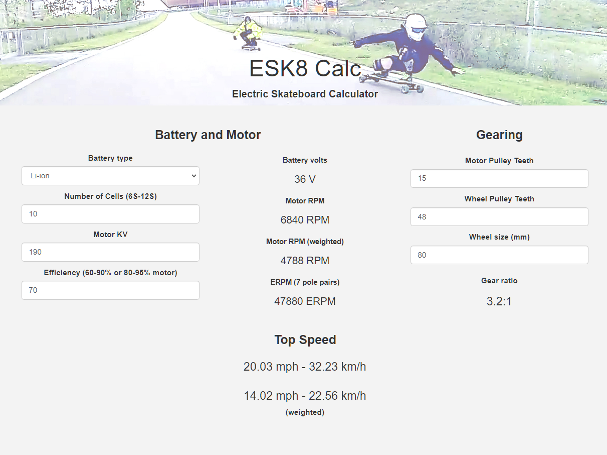

This a post for building a safe and inexpensive electric skateboard for commuting. Since this was my first build of a DIY skateboard, tons of research was done. I hope this helps other people with the same project.

This is the electronics layout of electric skateboard. Don't recognize some components?
[Diagram from ESK8 forum](https://www.electric-skateboard.builders/t/wiki-a-beginner-guide-to-diy-an-esk8/46844) for the fundamentals.

## The Build

### Deck and Trucks

The type of board will determine the size of the motor, case, and batteries. I went with a [flexible long deck](https://www.amazon.com/gp/product/B00I4KKPVM/ref=as_li_ss_tl?ie=UTF8&psc=1&linkCode=ll1&tag=dctm-20&linkId=89834a15bdf89d0203b903247a23e097&language=en_US) for cruising leisurely.

Most skateboard truck hangers are not very long which made it difficult to make this build small. Enough space is needed to mount an electric motor with a gears. Forums pointed to the 10 inch [Caliber Trucks](https://www.amazon.com/gp/product/B00NY3Q5P4/ref=as_li_ss_tl?ie=UTF8&psc=1&linkCode=ll1&tag=dctm-20&linkId=b2a59432f37ae7d737c45a2b482b5ecd&language=en_US) that have a square hanger (holds the axle). Paired with the [mounting kit](https://www.amazon.com/Motor-Compatible-Electric-Skateboard-Premium/dp/B07JK5VLVK/ref=as_li_ss_tl?crid=2IRK5BLUNQ4IC&dchild=1&keywords=caliber+trucks+motor+mount&qid=1576449000&sprefix=caliber+trucks+mo,sporting,194&sr=8-2&linkCode=ll1&tag=dctm-20&linkId=a4af203c682d290f9b77a573df56f036&language=en_US), it worked perfectly.

### Motor, Gears, and Wheels

The ESK8 [Calculator](http://calc.esk8.it/#{%22batt-type-lipo%22:1,%22batt-cells%22:8,%22motor-kv%22:200,%22system-efficiency%22:70,%22motor-pulley-teeth%22:16,%22wheel-pulley-teeth%22:48,%22wheel-size%22:80}|) was a great find! This saved me a bunch of time figuring out what kind of power, speed, and type of batteries needed.

Starting out with 2 x 8S batteries from a previous project, the following calculation was close to the expected top speed I was looking for.

[Electric motor](https://www.banggood.com/BRH5055-200KV-Brushless-Motor-For-Electric-Scooter-Skateboard-DIY-Kit-p-1465051.html?rmmds=myorder&cur_warehouse=CN)

[Gears and belt kit](https://www.amazon.com/Hitommy-17pcs-Pulley-Wheels-Electric/dp/B07RXV6H4L/ref=as_li_ss_tl?keywords=Drive+Kit+Parts+Pulley+And+Motor+Mount+For+80MM+Wheels+Electric+Skate+Board&qid=1576465899&s=sporting-goods&sr=1-1-catcorr&linkCode=ll1&tag=dctm-20&linkId=c8931c50e22ab88fe3879e599dc67805&language=en_US). 48 Teeth Bore (the big gear): 22mm; 16 Teeth Bore: 8mm (the small gear). The belt also comes with it.

### Electric Speed Controller

A speed controller controls the speed of the electric motor using PWM (pulse width modulation) signal. That will determine the speed the electric motor. I attempted using an inexpensive (\$25) 120A ESC (electric speed controller) for RC cars from a previous project. After 20 minutes, the ESC and batteries were hot 🔥🔥🔥.

New solution! [VESC](https://vesc-project.com/), is an open source project that addresses this problem with ESC made for scooters and skateboards at a reasonable price! It's a software configured ESC! The wizard was easy to follow with great documentation. Before buying any parts, checkout the [VESC calculator](https://vesc-project.com/calculators) to help purchase motors and batteries.

### Putting it all together

[Anti-Spark](https://www.amazon.com/gp/product/B0732S5V85/ref=as_li_ss_tl?ie=UTF8&psc=1&linkCode=ll1&tag=dctm-20&linkId=e497f6690184cf636639d3f85b71f4c1&language=en_US)

### Part list

- [Bamboo Skateboards Hard Good Blank Long Board](https://www.amazon.com/gp/product/B00I4KKPVM/ref=as_li_ss_tl?ie=UTF8&psc=1&linkCode=ll1&tag=dctm-20&linkId=89834a15bdf89d0203b903247a23e097&language=en_US)
- [Caliber Trucks Cal II 50° RKP Longboard Trucks - set of two](https://www.amazon.com/gp/product/B00NY3Q5P4/ref=as_li_ss_tl?ie=UTF8&psc=1&linkCode=ll1&tag=dctm-20&linkId=b2a59432f37ae7d737c45a2b482b5ecd&language=en_US)
- [Gears and belt kit from Amazon](https://www.amazon.com/Hitommy-17pcs-Pulley-Wheels-Electric/dp/B07RXV6H4L/ref=as_li_ss_tl?keywords=Drive+Kit+Parts+Pulley+And+Motor+Mount+For+80MM+Wheels+Electric+Skate+Board&qid=1576465899&s=sporting-goods&sr=1-1-catcorr&linkCode=ll1&tag=dctm-20&linkId=c8931c50e22ab88fe3879e599dc67805&language=en_US) or [from Banggood](https://www.banggood.com/17pcs-Drive-Kit-Parts-Pulley-And-Motor-Mount-For-80MM-Wheels-Electric-Skate-Board-p-1359469.html?rmmds=myorder&cur_warehouse=CN)
- [Caliber Trucks Mounting kit](https://www.amazon.com/Motor-Compatible-Electric-Skateboard-Premium/dp/B07JK5VLVK/ref=as_li_ss_tl?crid=2IRK5BLUNQ4IC&dchild=1&keywords=caliber+trucks+motor+mount&qid=1576449000&sprefix=caliber+trucks+mo,sporting,194&sr=8-2&linkCode=ll1&tag=dctm-20&linkId=a4af203c682d290f9b77a573df56f036&language=en_US)
- [80mm wheels](https://www.amazon.com/Slick-Revolution-Electric-Skateboard-Longboard/dp/B07JPBJHRZ/ref=as_li_ss_tl?dchild=1&keywords=New+Electric+skateboard+wheels+82A&qid=1576444946&s=sporting-goods&sr=8-1-fkmr2&linkCode=ll1&tag=dctm-20&linkId=423002917c69a239a0660073e31f46cd&language=en_US)
- [Electric Speed Controller](https://www.amazon.com/gp/product/B07GFB55NV/ref=as_li_ss_tl?ie=UTF8&psc=1&linkCode=ll1&tag=dctm-20&linkId=f893c08ca916935b035bd6d209117923&language=en_US)
- [Remote](https://www.amazon.com/vanpro-Electric-Skateboard-Wireless-Receiver/dp/B07L498PZR/ref=as_li_ss_tl?keywords=electric+skateboard+controller&qid=1576480857&sr=8-2-spons&psc=1&spLa=ZW5jcnlwdGVkUXVhbGlmaWVyPUExSFRHUElCSElMREYwJmVuY3J5cHRlZElkPUEwOTkwMTE2MUJXSzY4WlRJS1RaSSZlbmNyeXB0ZWRBZElkPUEwMDc3MzI1MUM0U00wVVhNWDIyRyZ3aWRnZXROYW1lPXNwX2F0ZiZhY3Rpb249Y2xpY2tSZWRpcmVjdCZkb05vdExvZ0NsaWNrPXRydWU=&linkCode=ll1&tag=dctm-20&linkId=73e4978f8ac30048a4794c2ee727d348&language=en_US)
- [Plastic box](https://www.amazon.com/gp/product/B07Y21LRWB/ref=as_li_ss_tl?ie=UTF8&psc=1&linkCode=ll1&tag=dctm-20&linkId=7be8fa2b85c063dcb9fd11567a3b7303&language=en_US)
- [Motor](https://www.banggood.com/BRH5055-200KV-Brushless-Motor-For-Electric-Scooter-Skateboard-DIY-Kit-p-1465051.html?rmmds=myorder&cur_warehouse=CN)
- [XT90](https://www.amazon.com/gp/product/B0732S5V85/ref=as_li_ss_tl?ie=UTF8&psc=1&linkCode=ll1&tag=dctm-20&linkId=e497f6690184cf636639d3f85b71f4c1&language=en_US)

## Lessons Learned

Even with all the planning and avaiable free parts
