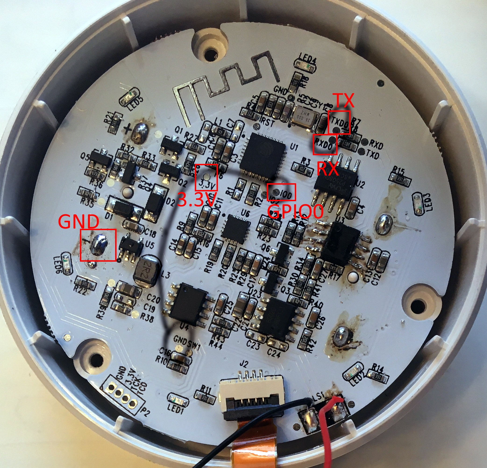
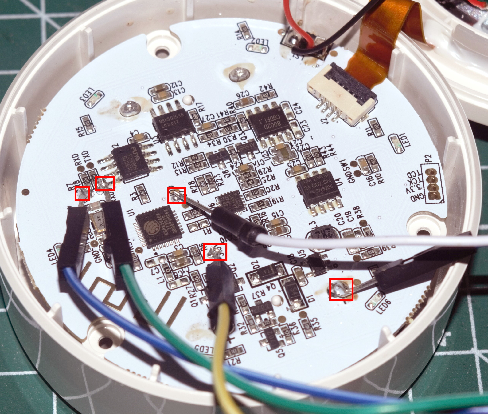
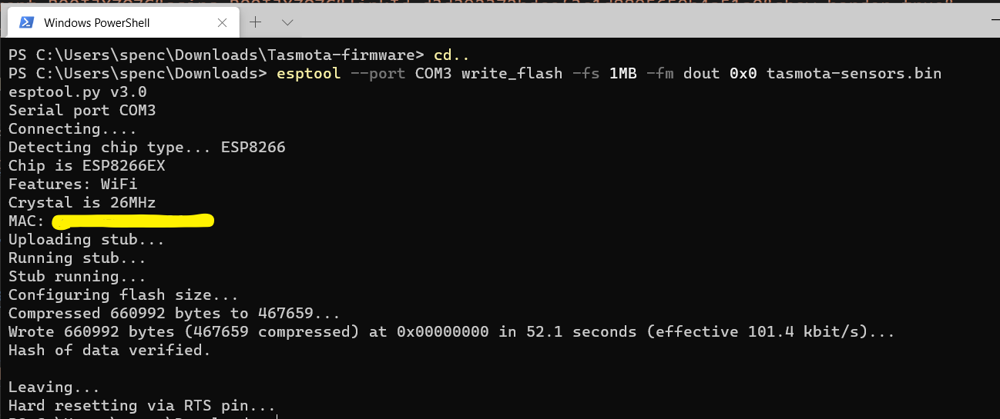
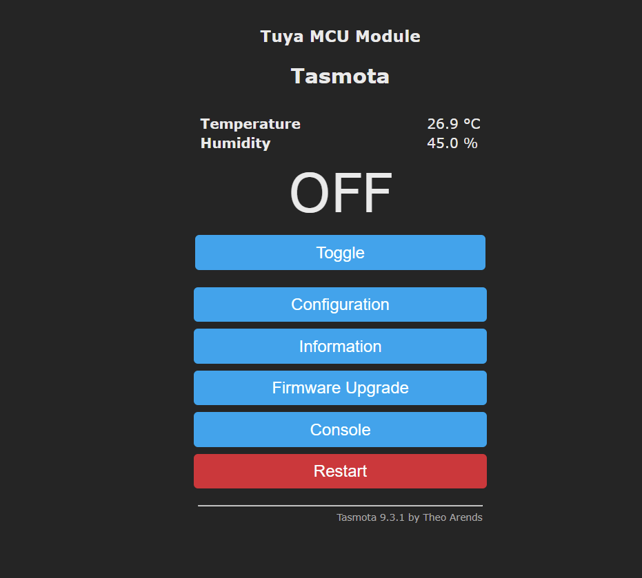

Guide for flashing a [NEO Coolcam Siren with Temperature and Humidity Multisensor](https://templates.blakadder.com/neo_coolcam_NAS-AB02W.html) with tasmota for local first connections.


## Wiring Guide

This is a condensed guide on flashing with tasmota. A full guide/getting started can be found in the official [documentation](https://tasmota.github.io/docs/Getting-Started/).

In order to flash this device, soldering onto the PCB will be required. There is a plate in the back that needs to be rotated to expose the battery holder.  Once that is open, go ahead and remove the three screws.  The tricky part is soldering onto the all connections. A Serial-to-USB Adapter like below will be required. All connections must be made. GPIO0 must be connected to ground (GND) in order to on boot in flash mode.

<iframe style="width:120px;height:240px;" marginwidth="0" marginheight="0" scrolling="no" frameborder="0" src="//ws-na.amazon-adsystem.com/widgets/q?ServiceVersion=20070822&OneJS=1&Operation=GetAdHtml&MarketPlace=US&source=ss&ref=as_ss_li_til&ad_type=product_link&tracking_id=dctm-20&language=en_US&marketplace=amazon&region=US&placement=B00IJXZQ7C&asins=B00IJXZQ7C&linkId=d3d392372bdcef3c1d8895659b4a51a0&show_border=true&link_opens_in_new_window=true"></iframe>

| **Device - Neo Coolcam** | **Flasher** |
| ------------------------ | ----------- |
| GPIO0                    | GND         |
| GND                      | GND         |
| TX                       | RX          |
| RX                       | TX          |
| 3.3v                     | 3.3v        |



Finalized soldering 



## Flashing

Install esptool. PyPi was quick for this: https://pypi.org/project/esptool/ 

`pip install esptool`

Time to flash. Run this command in the terminal. Doesn't matter if your Mac, Linux, or Windows when using PyPi.

`esptool --port COM3 write_flash -fs 1MB -fm dout 0x0 tasmota-sensors.bin`



Alternative, you can use a GUI version [Tasmotizer](https://github.com/tasmota/tasmotizer)

Connect to the access point to configure the default WiFi to connect too.

## Configuration 

Apply Template in "Configure Other"
`{"NAME":"Neo Siren 3in1","GPIO":[255,107,255,108,255,255,0,0,255,255,255,255,255],"FLAG":0,"BASE":54}`

### Tasmota Console Commands

| **Command**                                       | **Reason**                                         |
| ------------------------------------------------- | -------------------------------------------------- |
| `Backlog SetOption65 1; SetOption66 1; Module 54` | Fast power cycle and register as a Tuya module     |
| `TuyaMCU 11,104`                                  | Map alarm siren/led to toggle switch               |
| `TuyaMCU 71,105`                                  | Map indoor temperature                             |
| `TuyaMCU 73,106`                                  | Map indoor humidity                                |
| `TempRes 1`                                       | Instead of `291` it will be `29.1` for temperature |
| `TuyaSend2 113,0`                                 | Disable temperature alarm. Do with a rule instead  |
| `TuyaSend2 114,0`                                 | Disable humidity alarm. Do with a rule instead     |


All of this assumes there is a MQTT configured.  The temperature and humidity data wont show unless this is configured.  To undo this, use `SetOption66 0`. Optional, ensure dpId states were set by running `TuyaSend0`. Now that everything is hooked up, the data will be polled and reported every so often.


```log
01:42:21.463 MQT: tele/tasmota_111111/SENSOR = {"Time":"2021-04-08T01:42:21","TuyaSNS":{"Temperature":28.5,"Humidity":4.3},"TempUnit":"C"}
```



I've also considered using rules to catch the Tuya event then publish the MQTT in that rule.

### NodeRed and other smart logic

Setup a MQTT node with `tele/tasmota_REPLACEWITHID/SENSOR` in NodeRed. Replace the MQTT ID from the Tasmota information screen (Information > MQTT Full Topic).

Add a function node that can handle temperature and/or humidity being undefined.  Optional to add information such as `measurement` for Graphana.

```javascript
msg.measurement = 'siren-tv';
try {
    var payload = JSON.parse(msg.payload);
    if(payload.TuyaSNS){
        msg.payload = {};
        if(payload.TuyaSNS.Temperature){
            msg.payload.Temperature = payload.TuyaSNS.Temperature;
        }
        if(payload.TuyaSNS.Humidity){
            msg.payload.Humidity = payload.TuyaSNS.Humidity * 10;
        }
    }
} catch(ex) {
    node.error("unable to get temp and humidity", msg);
    return;
}
return msg;
```

To turn on the siren remotely. Send either `ON` or `OFF` to the MQTT topic `cmnd/tasmota_REPLACEWITHID/POWER` A return MQTT message returns with `stat/tasmota_REPLACEWITHID/POWER`

## Resources
- https://templates.blakadder.com/neo_coolcam_NAS-AB02W.html
- https://gist.github.com/patrickdk77/b687448fecff68d8572ac79a27d07862
- https://tasmota.github.io/docs/TuyaMCU/#tuyasend-command- 