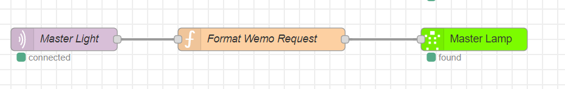

The biggest rule about home automation is not to change existing behavior for users that causes inconvenience. Which is a rule that easily forgotten. Let's use the classic example of a smart light bulb in a living room. A user typically flips a switch to turn on a light. Now they have to ask Alexa, Google, or use an app on their phone. **This is bad.**


After awhile the home smart device gets removed because it's causing inconvenience because the user can't flip a switch.

## Solutions

The 2 common solutions presented in this situation:

**1. Blocking the user** with tape or other mechanism. Checkout Thingiverse to see how common this is: <https://www.thingiverse.com/tag:Light_Switch_Cover>. This changes user behavior so it's a bad idea.

**2. Replacing the light switch** with a smarter one. This is the best option but requires a hardware replacement of the light switch. Which may not be possible, costly and potential dangerous to do-it-yourself!

**3. A third hybrid solution: Trigger the smart device with the existing light switch using power wall outlet as feedback** using an Arduino device with WiFi. In this solution, the light switch changes the power state of the outlet that the Arduino based micro controller is monitoring. When the light switch is turn on/off it changes the power to the Arduino analog voltage GPIO pin. That sends a message off to a home assistance to notify the smart device. In US based homes, the 2nd wall outlet still has power so it provides constant power to the device. Here is a diagram to get an idea of the flow to toggle the smart bulb state from a user.


The advantages:

- Simple & low effort
- Use existing switches to make them smart
- Ability to control multiple devices with a single switch
- Open source

---

## Building the Device

### Step 1: Get the Components and Solder Them

#### Tools

- Soldering iron
- Third hand or vise

#### Material

- [Wemos mini d1 from Amazon](https://amzn.to/2zI2nUf) or similar esp8266 / esp32 device
- 2 x resistors (any two usually works, i used 10k)
- Wire
- 2 5v usb wall chargers.
- 1 male usb plugin
- 1 regular usb charging cable for the esp32.
- led
- solder
- (optional) [bme280](https://amzn.to/2U2qCTM) or [bme680](https://amzn.to/2XL2C8U)


### Step 2: Download and Upload Software

Example MQTT message:

```json
{
  "id": "123456789",
  "switch": true,
  "temp": 27,
  "pressure": 1013,
  "humidity": 47
}
```

Source Code:

<https://github.com/skittleson/ArduinoProjects/tree/master/PowerSwitchMonitor>

### Step 3: Add to a Home Assistance

So here comes the part that could change per user preferences. I'm using NodeRed but this could be done with other home assistance software. The MQTT message is sent to this device using `mDNS` discover on the service `_mqtt._tcp`. The node `iot` is listening for messages. Using the `id`, the message is routed to specific to a change node then to a Wemo device to trigger a light in to a state.



## Resources

<https://learn.adafruit.com/adafruit-bme680-humidity-temperature-barometic-pressure-voc-gas/arduino-wiring-test>
<https://www.bosch-sensortec.com/products/environmental-sensors/gas-sensors-bme680/>
<https://lastminuteengineers.com/bme280-arduino-tutorial/>
