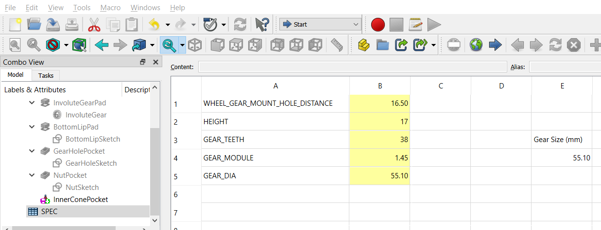
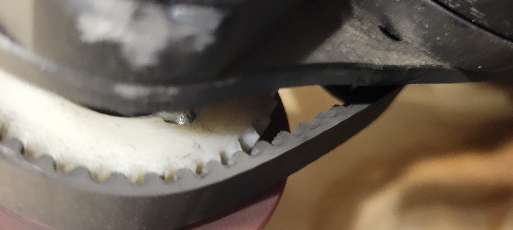

USE AT YOUR OWN RISK. It's been a few years riding on this 3D printed gear. Let's give an update from this [Reddit post i did few years ago](https://www.reddit.com/r/functionalprint/comments/hz8yn8/parametric_belt_driven_gear_for_diy_esk8/).

## Specs

[Downloadable FreeCAD version on GitHub](images/skateboardGearWheel/SkateboardWheelGear.FCStd)

- Printed with ABS at 0.3mm resolution. 
- [265-5M-9 5M Timing Belt](https://www.amazon.com/BESTORQ-265-5M-9-Timing-Outside-Circumference/dp/B00J9TXEQA?crid=MOIU9VWF3JOJ&keywords=265-5M-9%2B5M%2BTiming%2BBelt&qid=1655757673&sprefix=265-5m-9%2B5m%2Btiming%2Bbelt%2Caps%2C201&sr=8-1-spons&spLa=ZW5jcnlwdGVkUXVhbGlmaWVyPUExMlhRVlVONFhPTlk0JmVuY3J5cHRlZElkPUEwMTI5Mzg1MURaWUpDRUNIWFo1RyZlbmNyeXB0ZWRBZElkPUEwMjMxMzA3Mlo5RkxDN1g5WFAzSiZ3aWRnZXROYW1lPXNwX2F0ZiZhY3Rpb249Y2xpY2tSZWRpcmVjdCZkb05vdExvZ0NsaWNrPXRydWU&th=1&linkCode=ll1&tag=dctm-20&linkId=cc15402e422e37ad16e212a4e941dccb&language=en_US&ref_=as_li_ss_tl) or 265 mm Outside Circumference, 9 mm Width, 5 mm Pitch.
- Graphite powder on belt (pencil lead) to smooth out any noise.
- Fully parametric on gear sizes, mounting holes, hole sizes, and height
- 80mm wheel
- Rider is 200lbs. 
- Used with a BLDC motor at 8nM of force / 70amp peak with 12s battery
- Version 47
- Cost to print $1.45

<model-viewer style="width: 100%; min-height:300px;" alt="3D Rendering of model" src="images/skateboardGearWheel/SkateboardWheelGear-Body.gltf" ar ar-modes="webxr scene-viewer quick-look" camera-controls enable-pan>
</model-viewer>

## Parametric Adjustments

All measurements are in millimeters. Adjusted for [190kv BLDC motor with 16 tooth gear](https://www.amazon.com/Flipsky-Hardened-Electric-Skateboard-Brushless/dp/B08L5WDTSZ?crid=38MPS5ZVVS608&keywords=Flipsky%2BElectric%2BSkateboard%2B6374%2B190KV%2B3250W%2BBrushless%2BBLDC%2BMotor&qid=1655749320&s=toys-and-games&sprefix=flipsky%2Belectric%2Bskateboard%2B6374%2B190kv%2B3250w%2Bbrushless%2Bbldc%2Bmotor%2Ctoys-and-games%2C106&sr=1-1-spons&spLa=ZW5jcnlwdGVkUXVhbGlmaWVyPUEyTTI1T1lHSUk4TTBEJmVuY3J5cHRlZElkPUEwNzgzOTM2M0ZOOVlWODFKWDU5MSZlbmNyeXB0ZWRBZElkPUExMDQxMDE2M0tZUTdJSU43V0tWOSZ3aWRnZXROYW1lPXNwX2F0ZiZhY3Rpb249Y2xpY2tSZWRpcmVjdCZkb05vdExvZ0NsaWNrPXRydWU&th=1&linkCode=ll1&tag=dctm-20&linkId=00aab9f6e7dde286c70b7c3585039b04&language=en_US&ref_=as_li_ss_tl)

## Wear and Tear 

This was about 100+ hours of riding. It's hard to take a picture with it mounted. Here is a side view until I take it off the truck. <small>Better image coming soon...</small>

- Gear teeth have wore down as expected.
- It was noticeable louder than metal gear due to the pattern chosen for the teeth. Adding graphite powder every 10+ rides keeps it sounding smooth and prevents wear.
- The nuts came loose a few times... use lock tight.
- Belt wear was nominal.  I expecte to change it every 500+ hours of riding.
- The [bottom land](https://en.wikipedia.org/wiki/Gear) could be more round to fit the belt.
- No noticable cracks or layer spliting in the 3D print.
- Amount of material the bolt and nut can hold unto (or lack of it).  It could "rip off" the end of the plastic gear.  Using longer bolts then removing the inner "cut out cone" could help with that.  As well an additional nut for surface area tension.  No concerns as of yet since the wearing has been nominal.

## Next Possible Experiment 

Helical gears or double helical gears with no belt seems like an experiment to try out.  It offers a lot of benefits such as no belt, no belt slipping, quiter, and only 3D printed parts.

 
